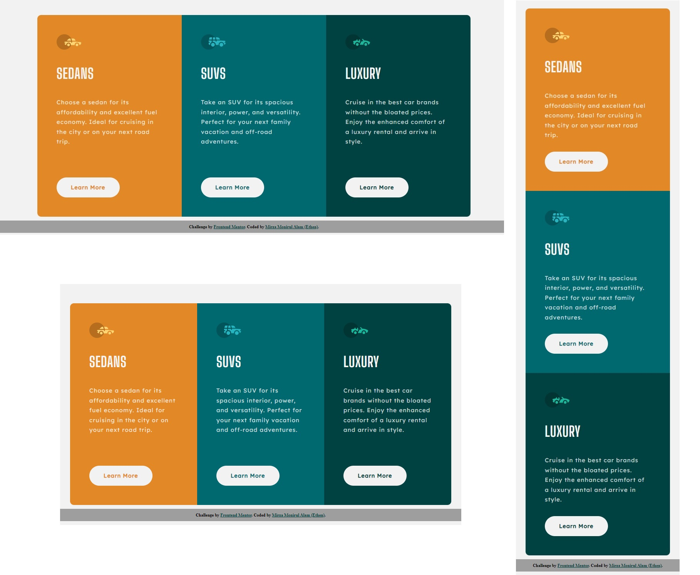
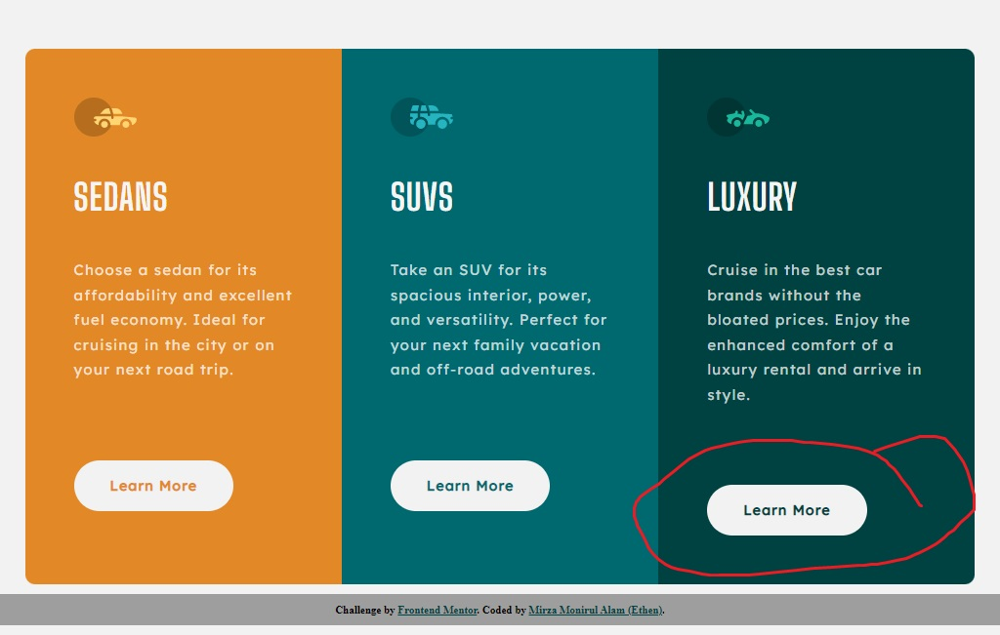

# Mobile Responsive Column Card Component Solution

This is a solution to the [3-column card component challenge on Frontend Mentor](https://www.frontendmentor.io/challenges/3column-preview-card-component-pH92eAR2-). 

- 31 March 2022

## Table of contents

- [The challenge](#the-challenge)
- [Screenshot](#screenshot)
- [Links](#links)
- [Author](#author)
- [Date](#date)

## The challenge

Users should be able to:

- View the optimal layout depending on their device's screen size
- See hover states for interactive elements

## Screenshot

## Links

- Solution URL: [Solution](https://your-solution-url.com)
- Live Site URL: [Live](https://ethenpage.github.io/Mobile-Responsive-3-column-card-component/)

## Issue
- Needs to continous development by using flexbox or grid. 
- Issue detected: 1024px device due to `
` padding.

## Author

- Name: Mirza Ethen (Mirza Monirul Alam).
- Frontend Mentor - [@EthenPage](https://www.frontendmentor.io/profile/ethenpage)

## Date

- 31 March 2022.